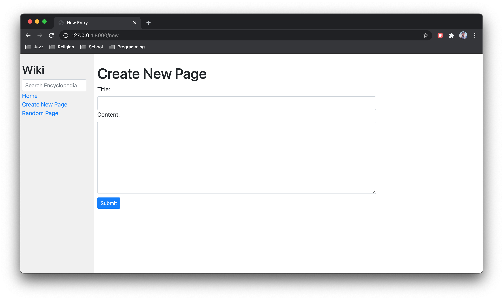

# Encyclopedia





## Description
This project uses HTML, CSS, and Django to create an online encyclopedia where users are able to create, view, and edit wiki entries.

- The sidebar displays a search form (where a query submission displays a list of search results), a new page option (where users are able to save a new entry), and a random page link (which renders a random entry).

- Visiting /wiki/TITLE, where TITLE is an existing entry name, renders a page displaying the contents of that entry. If no such entry exists, an error message is displayed with an option to create a new entry.

- When creating or editing entries, textfields can utilize the Markdown markup language.

## Requirements
This project utilizes the [Django](https://www.djangoproject.com/download/) framework.

It also utlizes the [python-markdown2](https://github.com/trentm/python-markdown2) package to convert Markdown content to HTML. 

```
$ pip install markdown2
```

## Running
To run this application, change into the outer wiki directory and run the following command from the terminal:

```
$ python manage.py runserver
```

Once the Django development server runs, visit the server's address to open the app.
